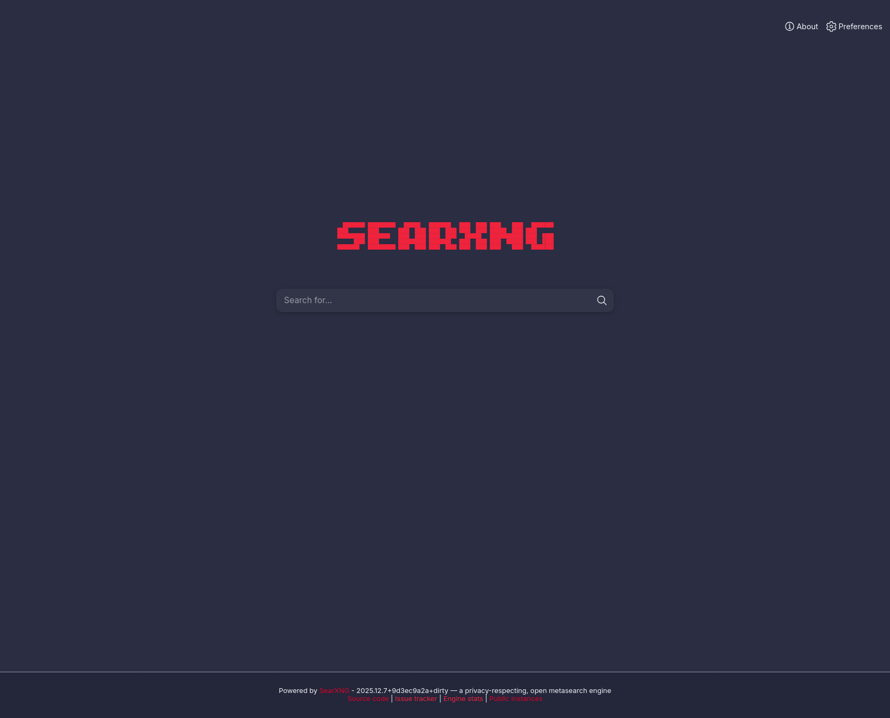
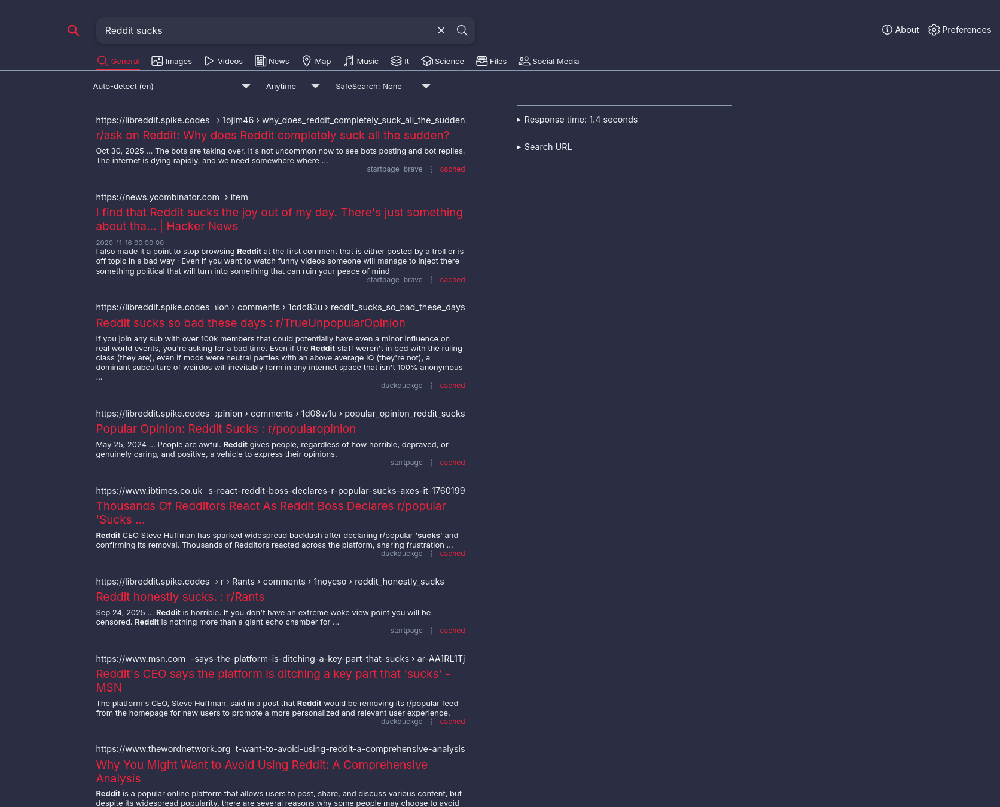

SearXNG fork with a custom theme and privacy-first defaults out of the box.

## Features

- Custom RAMA color scheme (space cadet blue #2b2d42, pantone red #ef233c)
- Static assets included
- TUI installer handles everything
- Generates secure keys automatically, uses center alignment

<div style="display: flex; gap: 10px; margin: 20px 0;">
  
  
</div>
  
## Installation

### Arch Linux (AUR)
```bash
yay -S searxng-rama
# or
paru -S searxng-rama
```

After installation, start and enable the service:
```bash
sudo systemctl start searxng-rama.service
sudo systemctl enable searxng-rama.service
```

### Quick Install Script
```bash
curl -fsSL https://raw.githubusercontent.com/Nomadcxx/searxng-RAMA/main/install.sh | sudo bash
```

### Manual Build
```bash
git clone https://github.com/Nomadcxx/searxng-RAMA.git
cd searxng-RAMA
go build -o rama-installer ./cmd/rama-installer/
sudo ./rama-installer
```

### Docker Installation
```bash
docker run -d --name searxng-rama -p 8855:8855 ghcr.io/nomadcxx/searxng-rama:latest
```

### Docker Compose Installation
```bash
docker-compose up -d
```

## Installation Details

The installer copies everything to `/opt/searxng-rama`, sets up a virtual environment, installs dependencies, generates a secret key, and configures the service to run on port 8855. Once done, visit <http://localhost:8855>.

## Uninstallation

Run the installer again and choose uninstall. It'll stop the service and clean up `/opt/searxng-rama`.

## Requirements

- Go 1.21 or later
