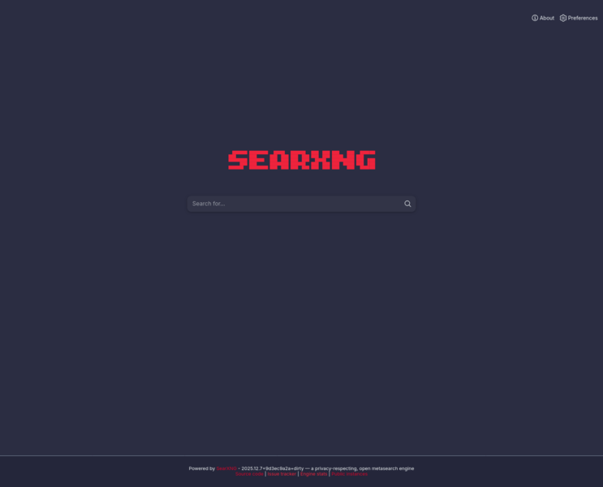
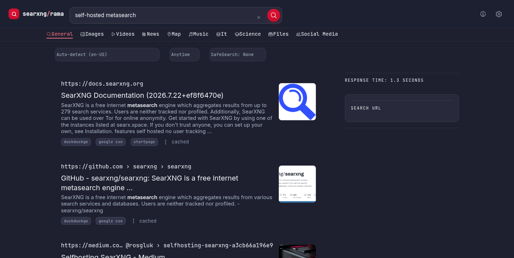
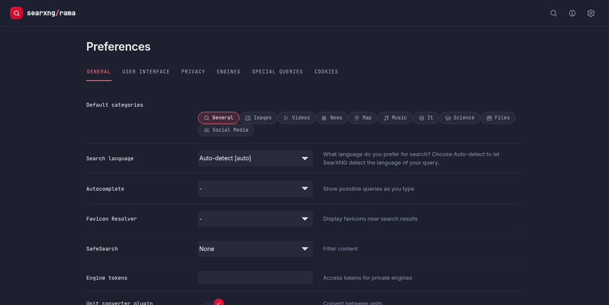

SearXNG fork with a redesigned UI and privacy-first defaults.



## Installation

### Arch Linux (AUR)

```bash
yay -S searxng-rama
sudo systemctl enable --now searxng-rama.service
```

Installs with the RAMA theme active. Switch variants any time:

```bash
sudo searxng-rama-theme google-dark   # no argument lists variants
```

### Docker / Docker Compose

```bash
RAMA_THEME=google-dark docker compose up -d
# or plain docker:
docker build -t searxng-rama .
docker run -d --name searxng-rama -p 8855:8855 -e RAMA_THEME=rama searxng-rama
```

Pick the theme with `RAMA_THEME` at deploy time; the container applies it at
start. Each container generates its own secret key unless you pin one with
`-e SEARXNG_SECRET=<hex>`.

### Debian / Ubuntu / Fedora

```bash
curl -fsSL https://raw.githubusercontent.com/Nomadcxx/searxng-RAMA/main/install.sh | sudo bash
```

The script installs dependencies, builds every theme variant, and launches the
TUI installer. Re-run the installer to switch theme or uninstall.

### Build from source

```bash
git clone https://github.com/Nomadcxx/searxng-RAMA.git
cd searxng-RAMA
go build -o rama-installer ./cmd/rama-installer/
sudo ./rama-installer
```

Every path ends the same way: <http://localhost:8855>.

## Theme variants

Three variants, built once at install time: **rama** (dark, default),
**google-light**, **google-dark**. Each ships as a pre-built CSS bundle
(`sxng-{ltr,rtl}.<variant>.min.css`); switching publishes the chosen bundle and
restarts the service. Nothing recompiles.

<div style="display: grid; grid-template-columns: repeat(2, 1fr); gap: 20px; margin: 20px 0;">
  
  
</div>

## Details

- Everything lives in `/opt/searxng-rama`: Python venv, SearXNG source with the
  theme compiled in, secret key, systemd service on port 8855
- Redesign covers home, results, preferences, stats and info pages;
  `design.md` holds the locked design system
- Self-hosted fonts (Inter + JetBrains Mono), no CDN calls
- Per-machine secret key, hardened systemd unit (`PrivateTmp`,
  `NoNewPrivileges`)
- WCAG AA contrast on every text/surface pair, enforced by
  `docs/redesign/check-contrast.py`

## Uninstall

- **AUR**: `sudo pacman -R searxng-rama`
- **Bare metal**: run the installer again and choose uninstall
- **Docker**: `docker compose down`

## Requirements

Each install path installs its own dependencies. For manual builds: Go ≥ 1.21,
Node ≥ 20 from a distro or NodeSource package (the nodejs.org tarball's npm
breaks the web build), Python ≥ 3.10.
